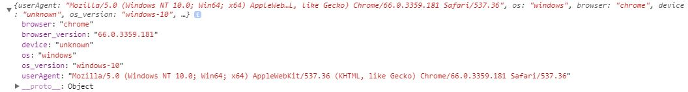

# ng2-device-detector

* Portfolio 프로젝트에서 사용자 디바이스의 정보를 알기위해 ng2-device-detector 모듈을 사용하였다.
* ng2-device-detector 모듈은 angular 2.x 이상의 버전에서 사용 가능하다.
* 현재는 ngx-device-detector 으로 바뀌었다.

### - 설치방법

        npm install ng2-device-detector --save

### - import

        import { Ng2DeviceDetectorModule } from 'ng2-device-detector';

        ...
        @NgModule({
        imports: [
            ...,
            Ng2DeviceDetectorModule.forRoot()
        ],
        })
        export class AppModule { }

### - 사용 예시

* 위와 같이 사용자의 디바이스 정보가 출력된다.
디바이스 값은 아래와 같다.

        'android' : Sumsung, Lg, Nexus, pixel
        'iphone' : iphone
        'windows-phone' : Lumia
        'unknown' : Blackberry, Nokia, Desktop
        'ipad' : ipad

참고 > https://www.npmjs.com/package/ng2-device-detector