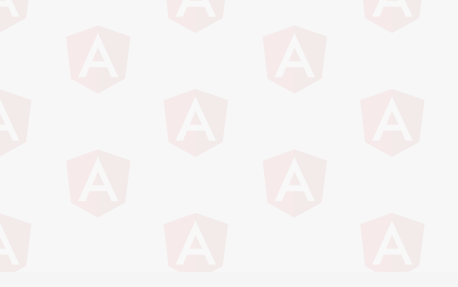
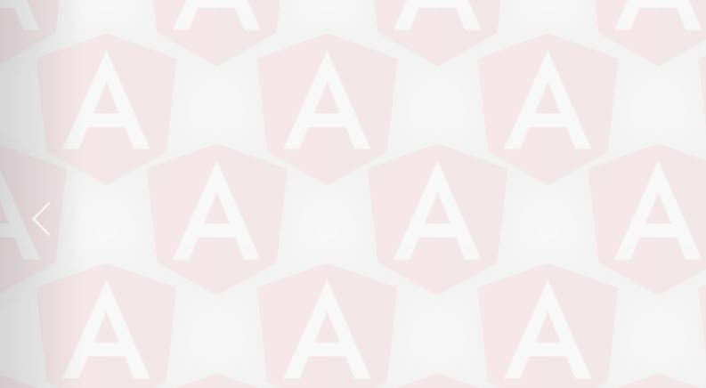

# image-diagonal-repeat

- background-image으로 2개의 이미지 사선으로 반복

background url에 2개의 파일을 추가하고 top, left 값을 넣어 repeat가 시작되는 지점 설정한다.

    background: url('/assets/angular-logo.png') top 0 left 0, url('/assets/angular-logo.png') top 130px left 200px;
    background-size: 400px auto;
    background-repeat: repeat;

- 적용 예제1
---

- 적용 예제2
---

사진에 공백이 없으면 이렇게 꽉 차 보인다.